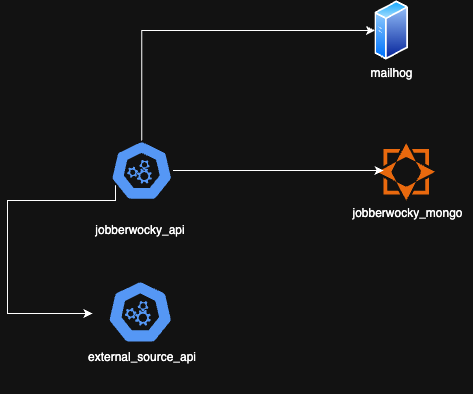
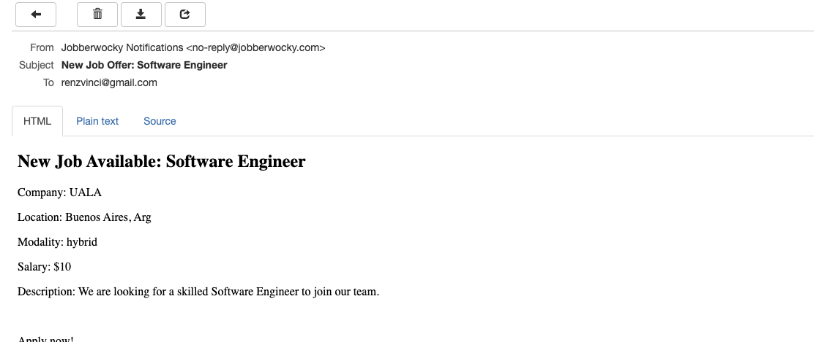

## Introduction
A holistic solution was designed to allow comprehensive testing through container deployment, eliminating the need for manual installations.

Although the challenge suggested using file-based persistence, SQLite, or other options, I chose MongoDB as the database.

Regarding TDD, only one test is included. While it is brief, the entire project was thoroughly tested. However, I couldn't dedicate as much time to writing additional tests as I would have liked. Similarly, some query structures might be subject to optimization or improvement.

## Build and Deploy Containers
```
docker-compose up -d --build
```
This will start the following services:

- Mongo
- Jobberwocky API (home project)
- External Source API (jobberwocky-extra-source-v2)
- MailHog
- Mongo Express



## Jobberwocky API 
### Available Services
#### GET /jobs
Retrieves a list of job offers based on the provided filters and external resource data

#### Request Example:
````
GET /jobs?name=Developer&salary_min=50000&salary_max=100000&country=USA&modality=remote
````
#### GET /jobs/:job_id
Get a specific job offer by Id

⚠ Note: Currently, this endpoint only supports job offers from Jobberwocky and does not process external job sources.
#### Request Example:
````
GET /jobs?name=Developer&salary_min=50000&salary_max=100000&country=USA&modality=remote
````

#### POST /jobs/
Creates a new job offer.

#### Request Example:
```
POST /jobs/
Content-Type: application/json 
```

#### DELETE /jobs/:job_id
Delete a job offer

#### Request Example:
```
DELETE /jobs/:job_id
```
#### POST /subscribers/
Creates a new subscribers.

#### Request Example:
```
POST /subscribers/
Content-Type: application/json 
```

For more information, check the API's POSTMAN collection in the documentation/ directory located at the root of this project.
[Avature Jobberwocky API.postman_collection.json](documentation/Avature%20Jobberwocky%20API.postman_collection.json)

## Mongo Express
To visualize data persistence, you can use Mongo Express by connecting to:
http://localhost:8081
````
username: admin
password: secret
````

## Mailhog
According to the subscriber's preferences, when a new Job Offer is created, an event is triggered to evaluate if there are any subscribers interested in that job offer. If they are interested and their alert method is email, the system sends them an email with the job details. 

⚠ Note: At the moment, it only evaluates work modality and country.

You can view the inbox for these emails at:
http://localhost:8025


